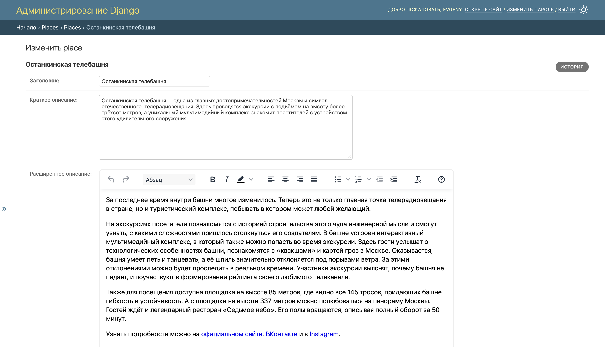
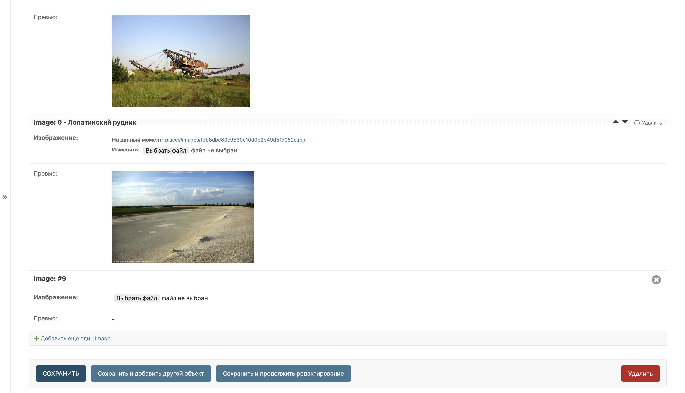
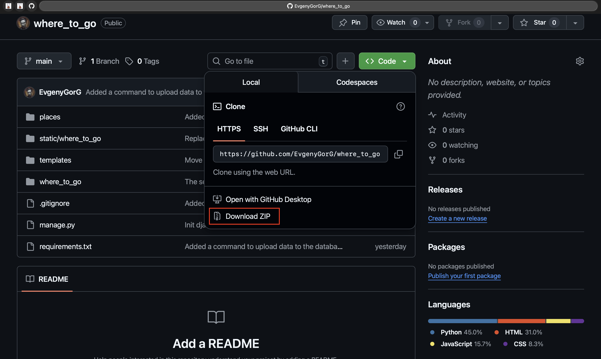
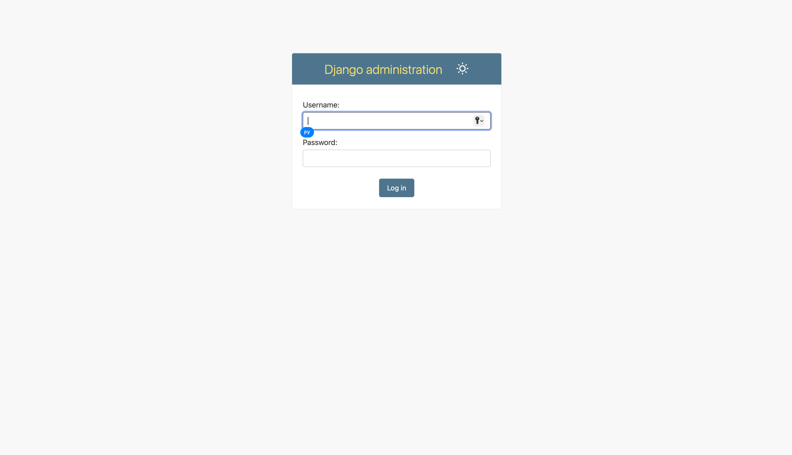
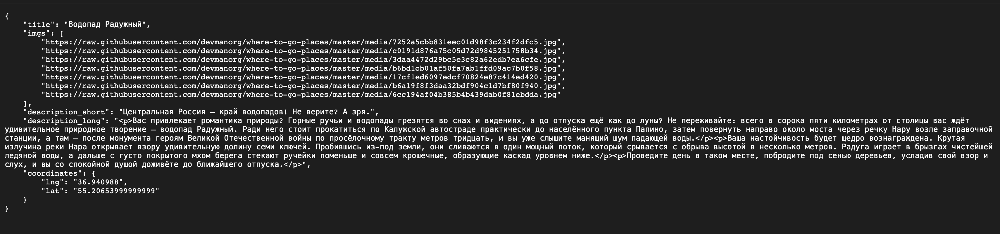

# Москва-look
Проект представляет собой сайт о самых интересных местах в Москве.


## Функциональность
- Просмотр локаций с описаниями и фото на карте Москвы;
- Добавление и изменение содержимого локаций при помощи административной панели Django;
- Быстрое добавление новых локаций с помощью management команды и json файлов.

Django панель:




## Как установить
Скачайте репозиторий:



Убедитесь, что установлен [Python 3.13](https://www.python.org/downloads/release/python-3130/).

Для изоляции проекта рекомендуется использовать `.venv` виртуальное окружение:
```shell
python -m venv .venv
```

Активируйте виртуальное окружение:
**Windows**
```shell
.venv\Scripts\activate
```
**Linux/macOS**
```shell
source .venv/bin/activate
```

Затем используйте `pip` для установки зависимостей:
```shell
pip install -r requirements.txt
```

Для запуска и администрирования базы данных, используйте следующие команды:
```shell
python manage.py makemigrations
python manage.py migrate
python manage.py createsuperuser
python manage.py runserver
```
Команды `makemigrations` и `migrate` применяют миграции к базе данных.
Команда `createsuperuser` создает администратора для работы с приложением `django admin`.
При вводе команды, вам будет предложено создать логин и пароль,
для дальнейшей работы в приложении администрирования.



Команда `runserver` запускает локальный сервер, перейдя по ссылке на который, вы попадете на главную страничку сайта.
Вы сможете попасть на административную страничку `django` добавив к ссылке `/admin`, при первом запуске вам необходимо
ввести логин и пароль, затем можно приступать к работе.

Для быстрой загрузки локации в базу данных при помощи management команды Django вам необходимо иметь выгруженный
файл `.json` формата, следующего образца:



Затем введите следующую команду, вместо `{url}` введите ссылку на файл:
```shell
python manage.py load_place {url}
```

## Переменные окружения
Для работы с переменными окружения переименуйте файл `.env.example` в`.env`.

В файле находятся следующие переменные:
- Обязательные:
 * `DJANGO_SECRET_KEY=` - секретный ключ проекта, необходимо указать;
- Опционально:
 * `ALLOWED_HOSTS=` - адрес хоста, укажите при деплое, при локальном запуске используются значения по умолчанию;
Остальные переменные можно удалить, если вы не запускаете проект локально.
- Для локальной разработки и локального запуска:
* `DEBUG=` - режим разработки, укажите `True` для получения развернутого Traceback;
* `CSRF_COOKIE_SECURE` и `SESSION_COOKIE_SECURE` - обработка cookie, для этих переменных укажите значение `False`.

`DJANGO_SECRET_KEY` Можно сгенерировать при помощи команды:
```shell
python -c "from django.core.management.utils import get_random_secret_key;
 print(get_random_secret_key())"
```
Скопируйте и вставьте выданный ключ в файл `.env`.

## Цели проекта

Код написан в учебных целях — это урок в курсе по Python и веб-разработке на сайте [Devman](https://dvmn.org).
